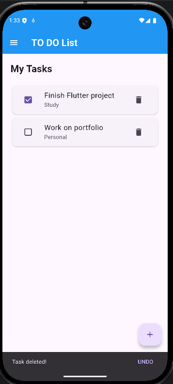
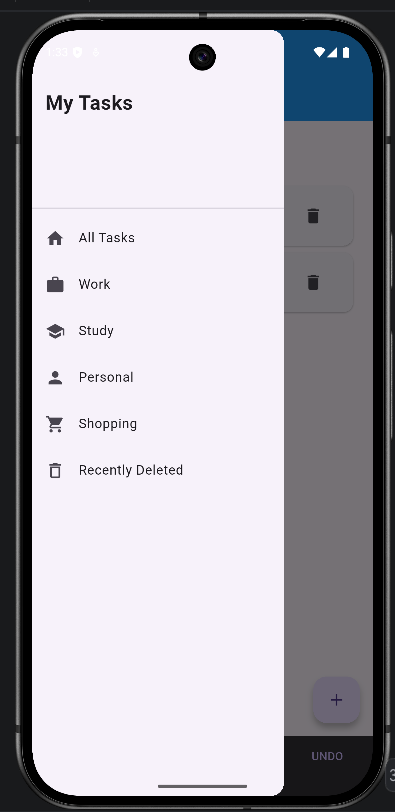

# 📝 Flutter To-Do List App

A simple and user-friendly **To-Do List mobile application built with Flutter and Dart**.
The app allows users to create, manage, complete, and delete tasks through a clean and intuitive interface.

## ✨ Features

* ➕ Add new tasks
* ✅ Mark tasks as completed
* 🗑️ Delete tasks
* ↩️ Restore deleted tasks
* 📂 View tasks by category
* 🗄️ View archived tasks
* 🔍 Simple and clean user interface
* 📱 Responsive Flutter UI
* 💬 User-friendly feedback messages

## 🛠️ Technologies Used

* **Flutter**
* **Dart**
* **Material Design**
* **Android Studio**
* **Git & GitHub**

## 📱 Screenshots

## 📱 Screenshots

<p align="center">
  
  
  
  
</p>

## 🚀 Getting Started

### Prerequisites

Make sure you have the following installed:

* Flutter SDK
* Dart SDK
* Android Studio
* Android Emulator or Android device

### Installation

1. Clone the repository:

```bash
git clone https://github.com/Lakshmii05/todo_list_appp.git
```

2. Open the project:

```bash
cd todo_list_appp
```

3. Get Flutter dependencies:

```bash
flutter pub get
```

4. Run the application:

```bash
flutter run
```

## 📂 Project Structure

```text
lib/
└── main.dart

android/
ios/
web/
windows/
macos/
linux/
```

## 🎯 Project Purpose

This project was created to practice and demonstrate **Flutter application development**, including UI design, state management, user interactions, and Git/GitHub version control.

## 👩‍💻 Developer

**Rajalakshmi K S**

GitHub: https://github.com/Lakshmii05

---

⭐ If you find this project useful, feel free to star the repository!
